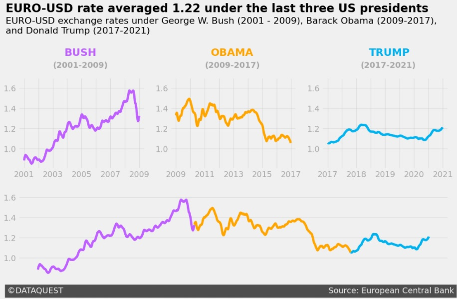

# Storytelling Data Visualization on Exchange Rates

This repo contains my personal implementation of Dataquest's Guided Project: [Storytelling Data Visualization on Exchange Rates](https://app.dataquest.io/c/96/m/529/guided-project%3A-storytelling-data-visualization-on-exchange-rates).

The idea behind this Guided Project is to use the most commom datascience techniques (data exploration, data cleaning, etc) on a dataset containing the exchange rates of euro to more than 40 different coins around the world, and then use concepts of Storytelling with data to create nice-looking graphs that tell a story.

On top of that, I used common clean code, documentation and code-safety techniques to ensure my code was as close to a production ready code as I could get it.

Below, are some graphs generated troughout the code:

#### Euro to Dollar Exchange Rate

#### Simple graph showing Real to Euro Exchange Rate

### Dependencies

This repo depends uppon the following python libs:
 
- Pandas
- Matplotlib

And I also use `pylint` to check if my code is up to [PEP8](https://www.python.org/dev/peps/pep-0008/) standards.