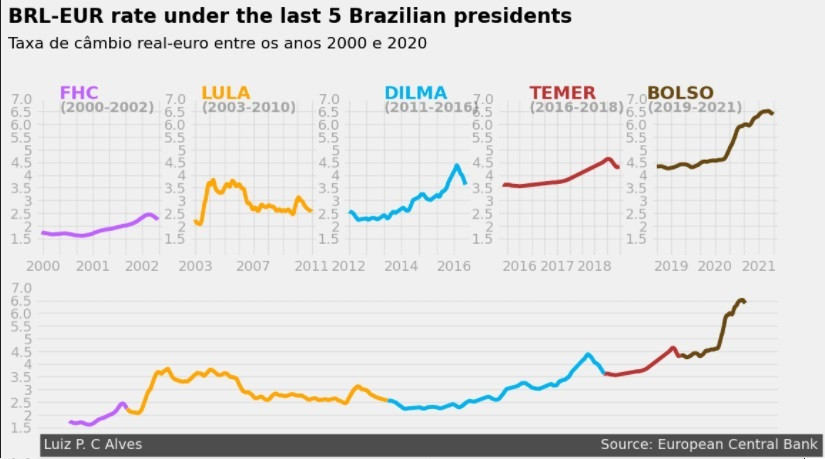
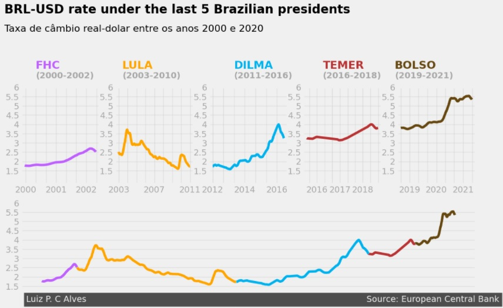

# Storytelling Data Visualization on Exchange Rates

This repo contains [lpdcalves](https://github.com/lpdcalves) and [rodolfostark](https://github.com/rodolfostark)'s implementation of Dataquest's Guided Project: [Storytelling Data Visualization on Exchange Rates](https://app.dataquest.io/c/96/m/529/guided-project%3A-storytelling-data-visualization-on-exchange-rates).

The idea behind this Guided Project is to use the most commom datascience techniques (data exploration, data cleaning, etc) on a dataset containing the exchange rates of the Euro to more than 40 different coins around the world, and then use concepts of Storytelling with Data to create nice-looking graphs that tell a story.

On top of that, we used common clean code, documentation and code-safety techniques to ensure the code was as close to a production ready code as possible.

Below we have some graphs generated troughout the code:

### Euro to Dollar Exchange Rate
<center>

</center>

### Simple graph showing Real to Euro Exchange Rate

<center>

</center>

### Real to Euro Exchange Rate troughout the last 5 Brazilian presidents

<center>

</center>

### Real to Dollar Exchange Rate troughout the last 5 Brazilian presidents

<center>

</center>


## Dependencies

This repo relies uppon the following python libs:
-Pandas
-Matplotlib

We also use `pylint` to check if the code is up to [PEP8](https://www.python.org/dev/peps/pep-0008/) standards and was used `pytest` to ran automated tests of our main class.

## Testing the code

First of all we need to install the dependencies:
```shell
$ pip install pylint
```
```shell
$ pip install pytest
```
Then we can run the tests:
```shell
$ pylint data_story_teller.py
```
```shell
$ pytest test_data_story_teller.py
```
